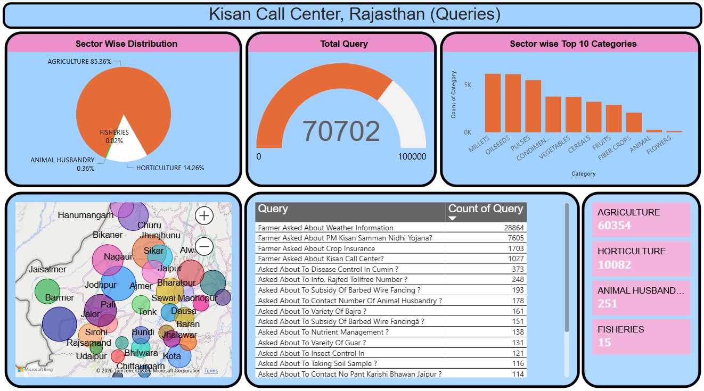

# Kisan Call Center, Rajasthan: Simplified Insights and Recommendations  

## Overview  
As part of a project assigned by my institute, I analyzed data to address a significant social issue. Coming from a farming family in Rajasthan, I chose to focus on understanding and solving the challenges faced by farmers in the state. To achieve this, I requested access to farmer-related queries from the **Indian National Data Portal**. I received the latest year of 2024 query data from the **Kisan Call Center** for Rajasthan. Despite the textual format of the data, I analyzed it and derived valuable insights that could significantly benefit the agricultural community.  

---

## Data Analysis  

### Total Queries  
The **Kisan Call Center** recorded a total of **70,702 queries** from farmers across Rajasthan.  

### Category-wise Distribution  
- **Agriculture**: 85.36%  
- **Horticulture**: 14.26%  
- **Animal Husbandry**: 0.36%  
- **Fisheries**: 0.02%  

This indicates that the majority of farmers rely heavily on agriculture, with limited focus on other livelihood options like horticulture, animal husbandry, or fisheries.  

### District-wise Analysis  
- **Top 5 Districts by Query Volume**:  
  1. **Nagaur**: 5,727 queries  
  2. **Barmer**: 5,621 queries  
  3. **Churu**: 5,505 queries  
  4. **Jodhpur**: 4,801 queries  
  5. **Bikaner**: 4,431 queries  

- **Districts with Lowest Queries**:  
  - **Banswara**: 224 queries  
  - **Dungarpur**: 249 queries  
  - **Pratapgarh**: 473 queries  

The disparity in query volumes highlights the need for targeted awareness campaigns in low-query districts to improve farmers’ engagement with the Kisan Call Center.  

### Key Topics of Queries  
**Weather Information**: 28,864 queries,**PM Kisan Samman Nidhi Yojana**: 7,605 queries,crop insurance, subsidies, disease management, and service-related contact information.

---

## Insights  
1. **Weather Dependence**: Farmers rely heavily on weather updates to plan agricultural activities, emphasizing the need for precise, real-time weather forecasts.  
2. **Government Schemes**: Despite high awareness, many farmers struggle to access benefits like the PM Kisan Samman Nidhi Yojana due to procedural barriers.  
3. **Low Engagement in Non-Agricultural Sectors**: Minimal queries related to horticulture, animal husbandry, and fisheries indicate the need to diversify income sources.  

---

## Recommendations  

### 1. Boost Awareness in Low-Query Districts  
- **Target Districts**: Banswara, Dungarpur, and Pratapgarh.  
- **Strategies**:  
  - Conduct localized campaigns in regional languages.  
  - Use traditional outreach methods such as village gatherings and fairs.  

### 2. Diversify Farmer Livelihoods  
- **Focus Areas**: Horticulture, animal husbandry, and fisheries.  
- **Action Plan**:  
  - Organize training workshops and hands-on demonstrations.  
  - Partner with **Krishi Vigyan Kendras (KVKs)** to provide expert guidance and support.  

### 3. Integrate Technology  
- **Proposed Solutions**:  
  - Develop mobile apps and AI-powered chatbots to offer quick query resolutions.  
  - Deliver automated weather updates in regional languages via SMS, mobile apps, and WhatsApp channels.  
- **Collaborations**: Partner with the **India Meteorological Department (IMD)** to ensure accurate and localized weather forecasts.  

### 4. Enhance Accessibility to Government Schemes  
- **Identified Gaps**: Farmers lack awareness and understanding of application processes.  
- **Proposed Solutions**:  
  - Conduct village-level workshops to educate farmers about schemes.  
  - Establish support centers to assist farmers in completing applications and resolving queries.  

---

## Impact  
Implementing these recommendations will:  
1. **Enhance Farmer Awareness**: Improved knowledge about the Kisan Call Center and its offerings.  
2. **Support Livelihood Diversification**: Provide alternative income opportunities for farmers.  
3. **Streamline Access to Information**: Ensure faster and more reliable query resolutions through technology.  
4. **Promote Government Initiatives**: Increase participation in schemes like PM Kisan Samman Nidhi Yojana.  

---

## Conclusion  
By addressing these challenges and adopting the proposed solutions, the **Kisan Call Center** can transform into a vital resource for farmers in Rajasthan. These efforts will empower farmers to tackle their challenges effectively, enhance their agricultural productivity, and secure sustainable livelihoods for the future.  

